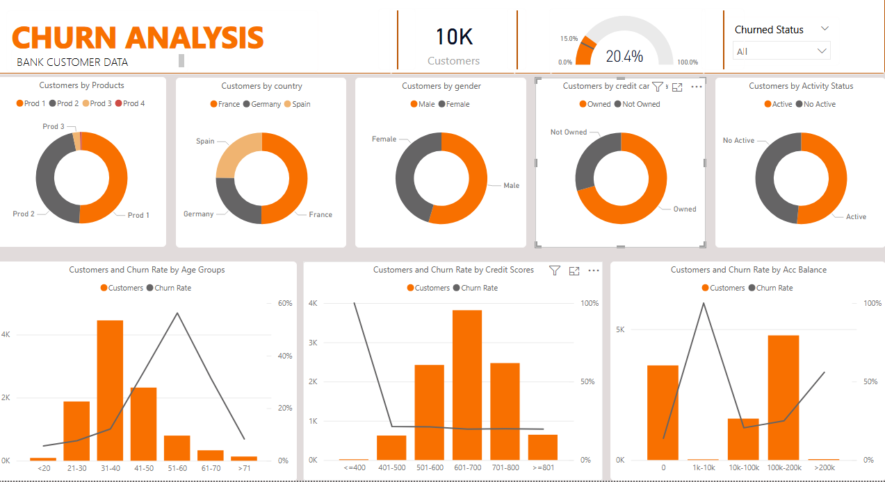

# 📊 Customer Churn Analysis — Power BI Portfolio Project

## 🧾 Overview

This Power BI project analyzes customer churn behavior across demographics, product types, account activity, and financial indicators. It helps businesses understand what drives churn and how to segment customers for better retention strategies.

---

## 📌 Business Problem

A banking institution is experiencing customer churn and wants to:

- Identify which customers are at risk
- Track churn rates by product, country, credit card ownership, etc.
- Segment customers based on age, account balance, credit score
- Design strategic actions based on trends and behavior

---

## 🎯 Goals

- Visualize overall and segmented churn rate
- Identify high-risk customer groups
- Compare active vs inactive customers
- Use filters to enable dynamic business questions

---

## 📊 Dashboards Overview

### 📍 Summary Dashboard

- Key KPIs: Total Customers, Churn Rate
- Churn split by product, gender, country, credit card status, and activity status

### 📍 Segment Analysis

- Customers and churn by:
  - Age groups
  - Credit score bands
  - Account balance ranges

> 

---

## 📑 Dataset Schema

The dataset contains customer-level data with the following columns:

| Column Name           | Description                                      |
|-----------------------|--------------------------------------------------|
| `customer_id`         | Unique identifier for each customer              |
| `credit_score`        | Credit score value (e.g., 600–800)               |
| `country`             | Customer location (France, Germany, Spain)      |
| `gender`              | Male / Female                                   |
| `age`                 | Customer's age                                   |
| `tenure`              | No. of years the customer has been with the bank |
| `balance`             | Bank account balance                             |
| `Product`             | Product subscribed (e.g., Prod 1, Prod 2)        |
| `credit card Status`  | Owned / Not Owned                                |
| `Activity Status`     | Active / No Active                               |
| `Churned`             | Target label – "Churned" or "Not Churned"        |
| `Products`            | Categorized product name                         |
| `Age Groups`          | Age bands (e.g., 21–30, 31–40)                   |
| `Credit Scores`       | Score groupings (e.g., 601–700)                  |
| `Acc Balance`         | Balance bands (e.g., 0, 10k–100k)                |
| `Churn Rate`          | DAX measure of % churn                          |
| `Customers`           | DAX count of customers                          |

---

## 🧰 Tools Used

| Tool            | Purpose                          |
|-----------------|-----------------------------------|
| Power BI        | Visualization & dashboarding     |
| Power Query     | Data cleaning & transformation    |
| DAX             | Measures for KPIs and insights    |
| Excel/CSV       | Raw data source                   |

---

## 📂 Folder Structure

